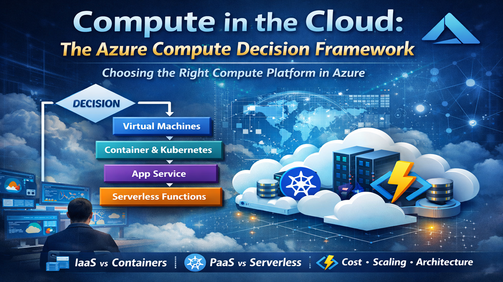

# Azure-Compute-DecisionFramework
Learn which compute service to choose and when

## Details
Azure offers many ways to run workloads — virtual machines, containers, Kubernetes clusters, serverless functions, and fully managed application platforms. With so many options available, one of the most important architectural skills is knowing which compute service to choose and when.

In this session, we’ll walk through the Azure Compute Decision Framework, a practical approach architects use to select the right compute platform for different workloads. We’ll explore the spectrum of Azure compute services and examine how factors like scalability, operational complexity, cost, and application architecture influence the decision.

Whether you're designing new cloud-native applications or migrating existing systems to Azure, this talk will help you make better compute architecture decisions.

You’ll learn:
- What Azure Compute Infrastructure includes and how it fits into cloud architecture
- The spectrum of compute models: IaaS, containers, PaaS, and serverless
- When to use services like Azure Virtual Machines, App Service, Kubernetes, Container Apps, and Azure Functions
- How to apply a decision framework to choose the right compute platform
- Common architecture patterns including web applications, microservices, and event-driven systems
- How scaling, reliability, and cost considerations affect compute choices
- Examples of modern Azure architectures

Who Should Attend
New to Azure?
Learn how different compute services work and when to use each one.

Developers and architects designing cloud applications
Understand how to select the right compute platform for scalability, performance, and cost.

IT professionals and engineers working with Azure
Gain a practical framework for designing and operating modern Azure workloads.

### Tags
Cloud Computing 
Microsoft Azure 
IaaS (Infrastructure as a Service) 
PaaS (Platform as a Service) 
SaaS (Software as a Service) 
